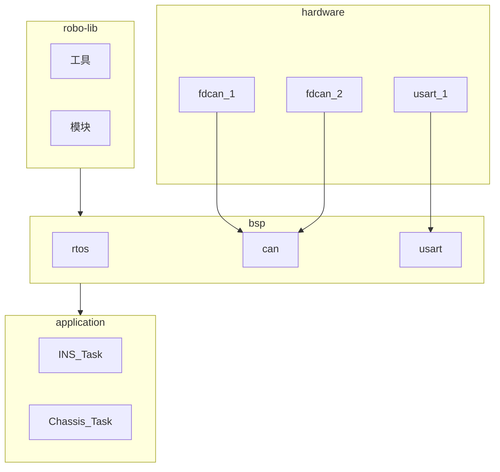

# TODO

## 一种分层组件化的程序架构

- bsp：底层硬件
- device：所有的通信协议层、电机、设备都包括进
- app：应用层

## 结构规范

所有组件从下到上，要求满足：

1. 本层不能依赖上层，给上层提供接口
2. 本层依赖下层，下层提供接口

上下层间接口方式：

- 上用下：下层直接提供接口函数
- 下用上：下层提供回调函数注册接口，注册表。采用这三种方式进行沟通1. 回调2. 订阅发布者总线3. 注册表轮询

此外区分主动模块和从动模块：

- 主动模块：允许调用内存，是一个主体或实例，调用或实例化别人
  1. 是线程或进程，是执行流源头，同层内平级，需要注意线程安全
  2. 是成品功能模块，在必要时加载到程序中成为上面第1类主动模块的一部分（或说框架）
- 从动模块：不能申请内存。被调用
  1. 是模板，形式一般是类定义（module lib）
  2. 是工具，一般就是函数、常量或宏（一般lib）

## 例

```text
usage example:

app       gimabal_task    chassis_task    command_task    detect_task
--------------------------------------------------------------------------------------
            ^            ^              ^                        ^           ^
          yaw_motor    pitch_motor    wheel_motor                |           |
          ------------------------    ---------------------      |           |
device    rm_motor_manager_can1       rm_motor_manager_can2    superCap    upper2lower
          ------------------------    ---------------------------------    -----------
          can1(or fdcan1)             can2(or fdcan2)                      uart1
--------------------------------------------------------------------------------------
            ^                                                                ^
bsp       bsp_can                                                          bsp_uart
```

## 思考程序的结构

程序主要分为两个东西：值、运算

- 值有基本类型，如 int float bool 等

- 运算有基本运算，如加法，减法等

在这里我们就可以看出来，有类和值的区别，而运算是属于某一种类功能，用于把属于这个类的一个值，变成属于这个类的另一个值。

那么我们引入类和对象的概念：

有一个集合 Class，包括一些值 object。在集合上可以定义某些运算 $f$，让 $object_1 \in Class$ 可以通过运算映射为另一个值 $object_2 \in Class$，写作 $object_1 \xrightarrow{f} object_2$

我们把这个集合叫做类（class），值叫做类的对象（object）（也叫做实例 instance），这些运算叫做类的方法（method）或成员函数（function）。

在编程语言中，如何定义某种类呢？用复合的方式：我们把其他类组合在一起，来作为一个新的类（有点像笛卡尔乘积）。我们叫他们成员变量。

如结构体，就是在创建类，而 C++ 中的 struct 和 class，则是可以指定方法的类，同时带了一些访问限制（如 public private protected）。

## 函数的函数，对象的对象

每一个变量都有属于他的方法函数，而把函数们放在一起，就是一段程序。

程序也是对象。

如果只有程序，而不关注这个程序对象的类是什么，这就是面向过程。

如果关注程序是否属于某个类，那么就是面向对象。

面向对象，一般用在封装和复用，他的目标是程序的元器件。

面向对象的最后一步，也是程序的最高层、应用层，因为在向上就不需要复用了，对象只有一个，就是程序本身，这时候再关注复用没什么意义。

类定义是对象的模板，模板类是类的模板；或者说，模板类的实例是类，类的实例是对象。

类到对象的过程，实际是复用模板到程序变量实例的过程，是从编译期到运行期的过程。换句话说，编译运行程序就是类实例化的过程，他从一个死的代码变成真实的内存数据。

而模板是类的类，他相当于在编译时生成代码。如果你想在编译器运行代码，其实可以使用模板。

## 规划一个系统框架

我想做的：一个库，上层和下层进行对接，效率提高，不依赖底层和上层，最大自定义，模块组件化，完全解耦。

库分为两个部分：一个是工具，一个是模块。

工具是都可以用的，模块是外界需要进行实例化、插入的

| 两个性质 | 是类 | 是程序 |
| -------- | ---- | ------ |
| 是工具   |      |        |
| 是模块   |      |        |

- 工具可被模块引用，或被外界引用

- 模块是成品代码，只被外界引用。

对于库内和库外而言，库内可能是对象或过程，库外一定的面向过程的。

当然了，你可以把用了这个库的代码写成模块，这时候叫做你的模块依赖了我的库。

例如这里，我想为所有的地方提供同样的库，这样我在 STM32H7 和 STM32F4 上都可以复用一些功能了，例如 imu 的姿态解算，例如电机等设备的通信和驱动，例如pid 等工具。


